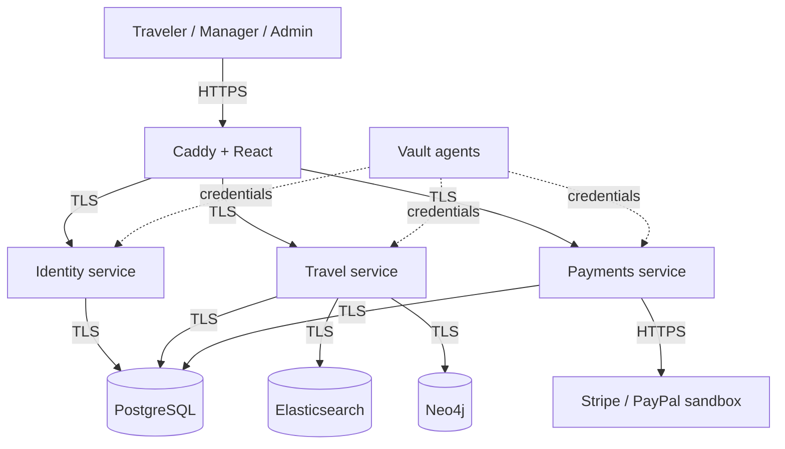

# Let's Travel

A travel management platform for discovering journeys, managing itineraries, and overseeing bookings and payments. Travelers, travel managers, and administrators each have a dedicated workspace.

[](https://github.com/hujaafar/lets-travel-platform/actions/workflows/verify.yml)


## Features

### Travelers

- Destination search, autocomplete, filters, and personalized recommendations.
- Journey details with multiple destinations, activities, accommodation, and transportation.
- Stripe and PayPal sandbox checkout, booking history, and eligible cancellations.
- Completed-trip reviews, manager profiles, private reports, and personal statistics.

### Travel managers

- Create, edit, publish, and archive owned itineraries.
- Manage journey capacity and inspect traveler lists and feedback.
- Track bookings and monthly income by currency.

### Administrators

- Manage users, roles, trips, payment gateways, and related records.
- Review transaction history with search and status filters.
- Use calendar views, manager rankings, and report moderation.

The responsive interface includes scroll-driven destination scenes, animated postcards, keyboard navigation, and shared styling across all workspaces.

## Technology

| Area | Stack |
| --- | --- |
| Frontend | React 19, TypeScript, Vite, Lucide |
| Backend | Java 17, Spring Boot, Spring JDBC |
| Storage | PostgreSQL, Neo4j, Elasticsearch |
| Infrastructure | Docker Compose, Caddy, Vault, Ansible |
| CI and quality | GitHub Actions, Jenkins, SonarQube |
| Testing | JUnit, Vitest, Python unittest, Playwright |
| Observability | Structured request logs, optional Loki and Grafana |

## Getting started

### Requirements

- Git and Docker with Compose v2.
- Python 3.10 or later.
- A JDK with `keytool` available on `PATH`.
- At least 4 GB of memory allocated to Docker for the application stack.

### Installation

```bash
git clone https://github.com/hujaafar/lets-travel-platform.git
cd lets-travel-platform
python -m pip install -r scripts/requirements.txt
python scripts/start.py
python scripts/seed-platform.py --rich
```

Open [https://localhost:8444](https://localhost:8444).

Startup generates local TLS certificates and private credentials. The administrator login is stored in `.secrets/admin-login.txt`. See [local development](docs/DEVELOPMENT.md) for account access, certificate setup, existing installations, and payment configuration.

To start two replicas of each Java service:

```bash
python scripts/start.py --replicas 2
```

Stop the application while retaining its data:

```bash
docker compose stop
```

## Architecture



PostgreSQL is the source of truth for accounts, itineraries, capacity, and bookings. Elasticsearch and Neo4j are updated through a retryable outbox. Each service uses a restricted database account and service-specific Vault configuration.

See [platform architecture](docs/PLATFORM.md) for service boundaries, booking rules, search, and recommendations.

## Project structure

```text
dashboard/          React application and browser tests
services/           Identity, travel, payments, and shared Java code
infra/              Containers, databases, Vault, Jenkins, Ansible, and Kubernetes
scripts/            Provisioning, startup, and verification tools
docs/               Architecture, operations, security, and development guides
.github/            Pull request template and CI workflow
```

## Testing

```bash
./mvnw test                         # Windows: .\mvnw.cmd test
python -m unittest discover -s scripts/tests -v
cd dashboard
npm ci
npm test
npm run build
```

For browser tests, start the application first, then run these commands from `dashboard/`:

```bash
npx playwright install chromium firefox
npm run test:e2e
```

Pull requests run two required CI checks:

- `lets-travel/jenkins`: tests, build, dependency audit, configuration validation, and SonarQube analysis.
- `lets-travel/live-tests`: Ansible deployment, service checks, Chrome/Firefox tests, replica recovery, and load verification.

Results and artifacts are available in [GitHub Actions](https://github.com/hujaafar/lets-travel-platform/actions). See [CI workflow](docs/GITHUB-WORKFLOW.md) for details.

## Documentation

| Guide | Contents |
| --- | --- |
| [Local development](docs/DEVELOPMENT.md) | Startup, accounts, TLS, payment configuration, and troubleshooting |
| [Platform architecture](docs/PLATFORM.md) | Services, discovery, bookings, and business rules |
| [Database schema](docs/SCHEMA.md) | Relationships, constraints, and cascades |
| [Security](docs/PLATFORM-SECURITY.md) | Authentication, authorization, secret management, and deployment boundaries |
| [Operations](scripts/README.md) | Provisioning and verification commands |
| [Kubernetes](infra/kubernetes/README.md) | Deployment manifests and HA preparation |
| [Design and credits](docs/DECISIONS.md) | Package choices, typography, photography, and asset attribution |
| [Contributing](CONTRIBUTING.md) | Branches, commits, pull requests, and review |

## Author

**Hussain Ali Hussain Jawad** — [@hujaafar](https://github.com/hujaafar)
