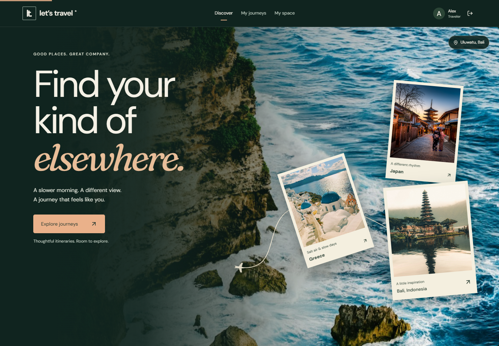
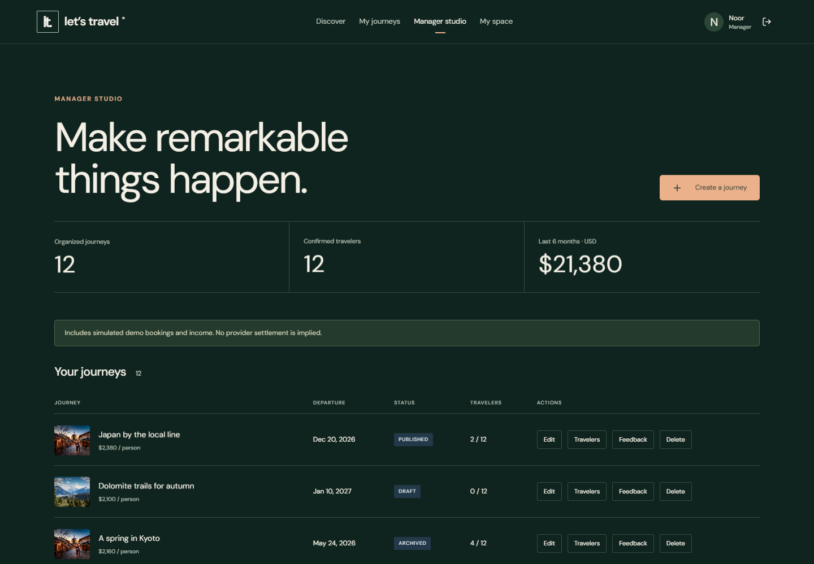
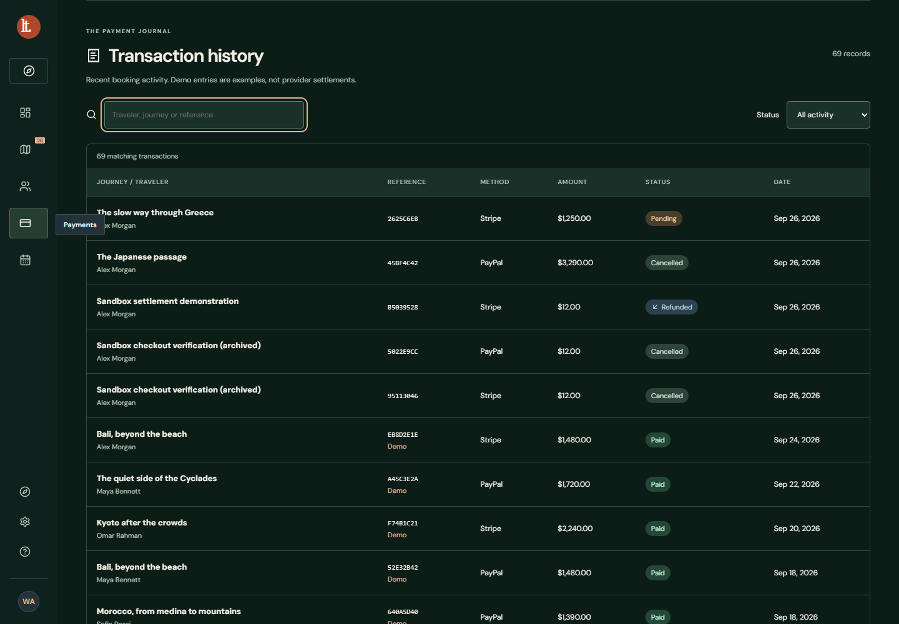
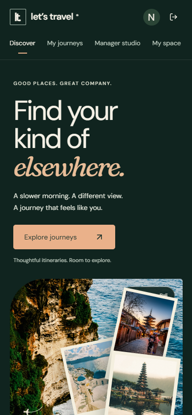
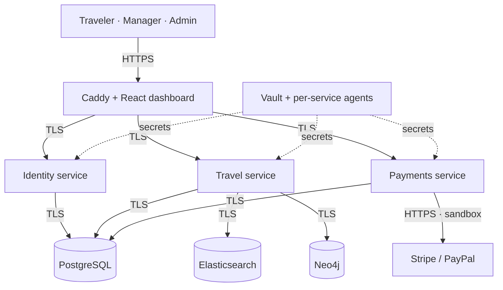

# Let’s Travel

**Find your kind of elsewhere.**

A full-stack travel platform with three connected workspaces: travelers discover and book journeys, managers organize them, and administrators oversee the entire operation. Built with Java microservices, a React interface, and an automated deployment and verification pipeline.

[](https://github.com/hujaafar/lets-travel-platform/actions/workflows/verify.yml)




[Features](#three-workspaces-one-platform) · [Architecture](#architecture) · [Run locally](#run-locally) · [Verification](#verification) · [Documentation](#documentation)

## Three workspaces, one platform

| Workspace | What you can do |
| --- | --- |
| **Traveler** | Search journeys with autocomplete and filters; explore recommendations; book through sandbox checkout; view bookings, cancel eligible trips, review attended journeys, and manage a profile. |
| **Travel manager** | Create and edit owned itineraries, manage publication and capacity, inspect travelers and feedback, and track booking totals and income by currency. |
| **Administrator** | Manage users, trips and payment gateways; use the calendar; review reports and manager rankings; inspect transaction history with search and status filters. |

Each journey supports multiple ordered destinations, dates, duration, activities, accommodation, transportation, pricing and capacity. Administration retains the original Travel Plan CRUD, authorization and database-cascade behavior. This repository consolidates both stages of the project; [migration notes](docs/PORTFOLIO.md) record what was compared and preserved.

### Designed around the journey

An editorial travel interface pairs forest-green surfaces and warm typography with destination photography. Native scrolling drives expanding scenes, route lines and a postcard collection; pointer movement adds depth without intercepting wheel input. Travelers, managers and administrators share the same controls, forms, spacing and visual language.

Motion is enabled by default and has no pause toggle in this version. Decorative rendering stops offscreen or in a hidden tab. The current design does **not** disable motion for the operating system’s reduced-motion preference. Direct navigation, keyboard controls and ordinary mobile scrolling remain available.

<details>
<summary><strong>More product screenshots</strong> — manager studio, transaction history and mobile discovery</summary>

#### Manager studio



#### Administrator transaction history



#### Mobile discovery



Screenshots use fictional accounts and seeded itineraries. Demo transaction states illustrate the interface; they are not evidence of provider settlement.

</details>

## Architecture



| Layer | Technology and responsibility |
| --- | --- |
| Interface | React 19, TypeScript, Vite, Lucide, locally served fonts and photography |
| Services | Java 17, Spring Boot, Spring JDBC, validated APIs and explicit role/ownership checks |
| Source of truth | PostgreSQL transactions, constraints, booking price snapshots and deletion rules |
| Discovery | Elasticsearch autocomplete and filtering; Neo4j recommendations based on attendance and feedback |
| Infrastructure | Docker Compose, Caddy TLS/load balancing, Vault AppRole policies, Ansible deployment |
| Delivery and operations | Jenkins, SonarQube, GitHub Actions, structured request logs, optional Loki/Grafana |

The identity, travel and payments services can run with two replicas each. PostgreSQL uses separate schemas and restricted service users in a shared database—an explicit project tradeoff rather than fully independent service databases. Search and graph projections use a retryable outbox; booking capacity and money remain authoritative in PostgreSQL.

See [platform architecture](docs/PLATFORM.md), [schema](docs/SCHEMA.md), and [package decisions and asset credits](docs/DECISIONS.md).

## Run locally

**Requirements:** Git, Docker Desktop or Docker Engine with Compose v2, Python 3.10+, and a JDK with `keytool` on `PATH`. Allow at least 4 GB of Docker memory; CI/tooling workloads need additional headroom. The first start downloads images and builds the services.

```bash
git clone https://github.com/hujaafar/lets-travel-platform.git
cd lets-travel-platform
python -m pip install -r scripts/requirements.txt
python scripts/start.py
python scripts/seed-platform.py --rich
```

Open **[https://localhost:8444](https://localhost:8444)**. Bootstrap creates a local certificate authority and a localhost certificate; your browser must trust that development CA for a warning-free connection. This is a local deployment, not a hosted public demo.

| Account | Local login details |
| --- | --- |
| Administrator | `.secrets/admin-login.txt` |
| Seeded manager and traveler | `.secrets/demo-login.txt` |
| Additional fictional accounts | `.secrets/demo-people.json` |

Passwords are generated locally. There is no published shared password. Keep `.secrets/` and `.env` private.

For two replicas per Java service, use `python scripts/start.py --replicas 2`. Once the current revision’s images are built, `--no-build` skips rebuilding them. Stop the local application with `docker compose stop`; its data volumes are preserved.

**Existing Let’s Travel installation?** This copy intentionally retains the `lets-travel` Compose project name and port 8444. Do not run it alongside an older checkout using the same stack. A fresh clone creates new secrets; use a clean Docker environment for a separate fresh installation. Keep an existing deployment’s matching secrets and volumes together when moving its checkout.

### Demo data

The rich seed adds **18 itineraries, 64 example bookings, 16 reviews, 10 fictional accounts and 3 report scenarios** in addition to the starter data. Inserts are repeatable and do not overwrite existing records. Demo bookings are explicitly labeled and excluded from provider reconciliation and refunds.

```bash
python scripts/verify-demo.py
```

See [demo activity](docs/DEMO-ACTIVITY.md) and the [walkthrough](docs/DEMONSTRATION.md).

## Sandbox payments

Stripe Checkout and PayPal Orders are integrated for testing trip bookings. Prices and currencies come from stored journey data; confirmation requires server-side provider verification. Duplicate bookings, capacity limits, cancellation deadlines and uncertain payment states are handled on the server. Refund processing uses stable idempotency keys.

To use your own sandbox accounts, follow [sandbox configuration](docs/DEMONSTRATION.md) and import a private credentials file:

```bash
python scripts/configure-sandbox.py --file /private/path/provider-sandbox.json
docker compose restart payments
```

Enable and verify the relevant gateway through **Admin → Payments**. Secrets are held in Vault and are not sent to the browser or included in CI.

**Verification boundary:** Stripe sandbox payment confirmation and refund were verified during development. PayPal credential validation and order creation were verified; the complete buyer-approval, settlement and refund cycle remains unverified. Seeded “Paid” rows and successful credential checks do not prove a payment settled. This project does not claim live payment readiness or PCI certification.

## Verification

Every pull request and push to `main` runs two independent jobs in [GitHub Actions](https://github.com/hujaafar/lets-travel-platform/actions):

- **`lets-travel/jenkins`** starts disposable Jenkins and SonarQube, runs the Java/React/Python checks, builds the application and evaluates the Sonar quality gate.
- **`lets-travel/live-tests`** deploys two service replicas through Ansible, checks roles, discovery, demo data, TLS and logging, tests reapplication and individual service deployment, then runs Chrome/Firefox, failover and load checks.

Sanitized evidence is uploaded as `jenkins-sonar-evidence` and `live-test-evidence` artifacts. Provider sandbox credentials are intentionally absent from hosted CI. Required checks protect `main`; this is a solo-maintainer project and does not claim independent human approval.

Run the unit suites locally:

```bash
./mvnw test                         # Windows: .\mvnw.cmd test
python -m unittest discover -s scripts/tests -v
cd dashboard
npm ci
npm test
npm run build
```

With the local application running, install Playwright’s Chromium and Firefox browsers, then run `npm run test:e2e` from `dashboard`. Live checks create temporary fixtures; run them against a test deployment.

## Security and deployment scope

TLS protects browser/API and internal database/service connections. Sessions use secure HTTP-only cookies, CSRF validation, BCrypt hashing, throttled login and role/ownership checks. Databases remain on internal Docker networks; Neo4j is isolated to the travel service. Vault renders service-specific credentials.

The local deployment is a single-host environment. [Kubernetes manifests](infra/kubernetes/README.md), autoscaling, disruption budgets and stateful HA templates are included as deployment groundwork; phase-two search and a real multi-node environment still need operator configuration and failure testing. They are not a production HA certification. See [platform security](docs/PLATFORM-SECURITY.md) and [production readiness](docs/PRODUCTION-HA.md).

## Documentation

| Guide | Purpose |
| --- | --- |
| [Platform](docs/PLATFORM.md) | Service boundaries, discovery, bookings and business rules |
| [Demonstration](docs/DEMONSTRATION.md) | Traveler, manager, admin and sandbox walkthrough |
| [Database schema](docs/SCHEMA.md) | Stored relationships, constraints and cascades |
| [API](docs/API.md) | Inherited admin endpoints; phase-two route map is in Platform |
| [Operations scripts](scripts/README.md) | Bootstrap, secrets, deployment and verification helpers |
| [Security](docs/PLATFORM-SECURITY.md) | Current controls and production limits |
| [Design decisions and credits](docs/DECISIONS.md) | Package choices, Scroll Craft adaptation, photography and font attribution |
| [Portfolio migration](docs/PORTFOLIO.md) | Consolidated scope, preserved history and verification records |

Built by [Husain Jaafar](https://github.com/hujaafar) as a travel-management portfolio project. Destination photographs are illustrative, not commercial trip listings. Third-party asset attribution and licenses are retained under `docs/licenses/` and in the design decisions.
